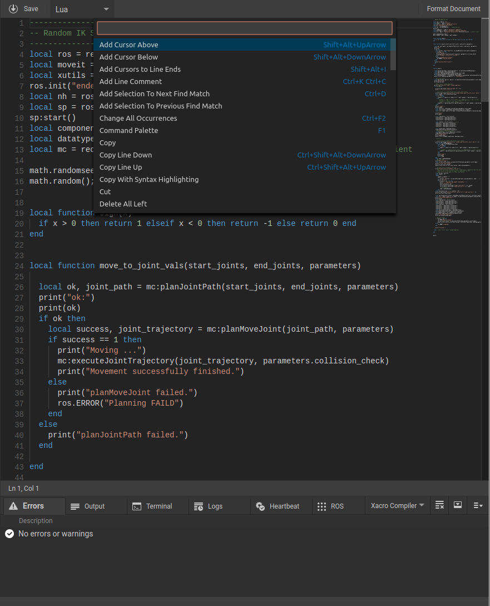

*********************
ROSVITA Code Editor
*********************

Double-clicking on a file in the integrated file browser opens it in the ROSVITA code editor, which offers several helpful features:

* First of all, ROSVITA has a **built-in .xacro compiler** so that when you open a .xacro file, buttons "Save" and "Compile" appear in the top bar of the editor. Moreover, to the right of the .xacro editor, a window opens, where you can switch between a 3D view of the corresponding robot configuration and the URDF output of the xacro compilation (see Fig. 7.1). The results of compiling the .xacro file are directly visible in the 3D view and the URDF output. Possible error messages of the compile process appear at the error output at the bottom of the ROSVITA programming environment.

   Figure 7.1  The ROSVITA xacro editor.

* For all other file formats, the "Compile" button is replaced by a display of the file type at the top bar.
* The line numbers are displayed on the left edge of the Code Editor. Moreover the bottom bar of the Code Editor also contains a display of the current line and column, in which the cursor is located.
* Pressing the **F1 key** will return all the commands (like "copy", "find", "replace", ...) and their shortcuts available in the code editor (see Fig. 7.2). Alternatively, the command overview can be obtained by right-clicking in the code editor and selecting the menu item "**Command Palette**".

   Figure 7.2  The ROSVITA code editor with open command palette.

