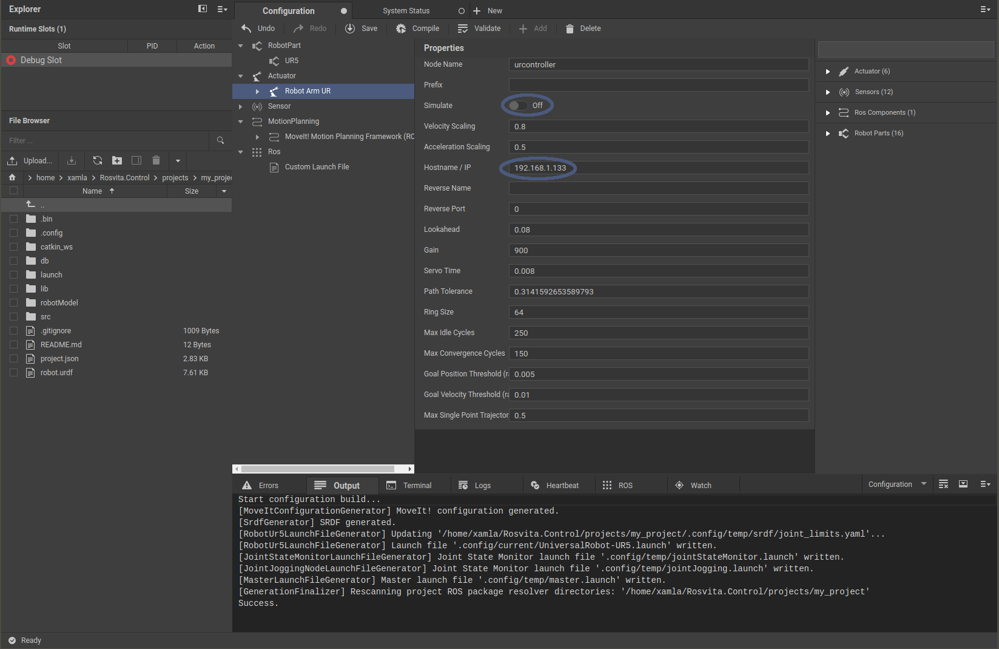

.. _complex-scene-label:

**************************
Building a Complex Scene
**************************

.. hint:: For a better understanding, it is recommended to first read the chapter :ref:`robot-config-label`.

If several robot parts of a scene shall be linked together (e.g. the right arm of a **Yaskawa Motoman SDA10D** and the **Weiss Robotics WSG-50 Gripper**), you have to adapt the **Parent link** in the **Properties** bar belonging to the corresponding robot part (e.g. the **WSG-50**).

Example (see Fig. 12.1)::

   Robot part: wsg50 mount
   Parent link: arm_right_link_tool0 (Motoman SDA10D) 

.. figure:: images/ParentLink_Setting.png

   Figure 12.1  Setting of a parent link in the properties list of a robot part.

Overall, the following robot parts with the following parent links are needed to e.g. connect the Weiss Robotics WSG-50 gripper with custom mount and fingers to the right arm of the Yaskawa Motoman SDA10D:

* Yaskawa Motoman SDA10D; ``Parent link: world``
* wsg50 mount; ``Parent link: arm_right_link_tool0 (Yaskawa Motoman SDA10D)``
* Weiss Robotics WSG-50; ``Parent link: mount_tool0 (wsg50 mount)``
* Weiss Robotics WSG-50 w1 right finger; ``Parent link: gripper_right_tool0 (Weiss Robotics WSG-50)``
* Weiss Robotics WSG-50 w1 left finger; ``Parent link: gripper_left_tool0 (Weiss Robotics WSG-50)``

In addition, the following actuators are needed:

* Motoman SDA10D (Yaskawa)
* Gripper WSG-50 (Weiss Robotics)

After pressing the **Compile** button, the robot with gripper should appear in the 3D view of the **Configuration** window.

Usage of identical robot parts (distinction via prefix):
---------------------------------------------------------

If several **same robot parts** shall be added to the scene (for example, **two WSG-50 grippers**), they must be distinguished by **Prefix**. Thereto, simply use the **Prefix field** in the **Properties** list for the corresponding robot part and actuator.

.. figure:: images/Prefix_RobotPart.png

   Figures 12.2 and 12.3  Prefix usage for e.g. two WSG-50 grippers.

If two **identical robot arms** shall be added to the scene (e.g. **two UR5 robot arms**), in addition to the distinction by **Prefix**, a **second move group** and a **second end effector** for this move group have to be created. This can be done by using the **+ Add** button in the top bar of the configuration view (see Fig. 12.5).

   Figure 12.4  Prefix usage for e.g. two UR5 robot arms.

.. figure:: images/2xUR5_MoveGroups.png

   Figure 12.5  Addition of a second move group and end effector for the second UR5 robot arm.

.. note:: To be able to select the renamed links (e.g. **second_base_link**) in the **Properties** list of e.g. the second move group, the **Compile** button has to be pressed after the renaming. Moreover, to be able to select the second move group as group for e.g. the second end effector, again the **Compile** button has to be pressed first. Hence, for creating a configuration with two identical robot parts, the **Compile** button has to be pressed **several times**.  

.. _config-real-robot-label:

Configuring a real robot:
--------------------------

To configure a real robot, in the **Actuator**'s **Properties** list the **Simulate** checkmark has to be removed and instead, the  IP address of the robot has to be entered (see Fig. 12.6). 

   Figure 12.6  Configuration of a real robot. (The IP address must be changed to the IP of your robot.)

.. note:: All USB devices (e.g. cameras) have to be plugged in before starting ROSVITA.

... to be continued

