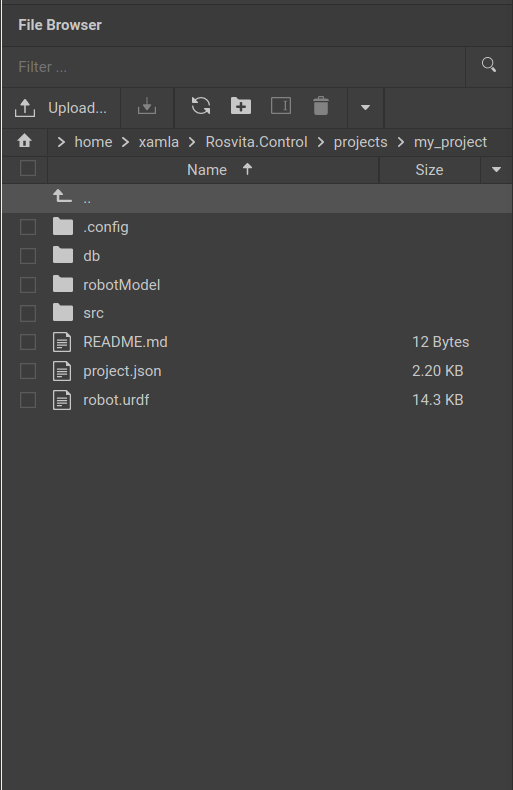

**********************
ROSVITA File Browser
**********************

The ROSVITA file browser is located on the left edge of the ROSVITA programming environment and offers all the convenience of a typical file browser:

* Display of the current path and change to the home directory by clicking on the house icon to the left of the path.
* Display of the contents (files and folders) of the current path as a list.
* Sorting of the contents list in ascending or descending order by name, size, date of last modification and creation date. To do this, either click directly in the bar above the file list on the desired sort criterion ("Name", "Size", ...) or right-click on the file list and select the menu item "Sort by".
* Filtering of the contents list by file or folder name. To do this, enter in the text box "Filter ..." at the top bar of the file browser the desired file or folder name and click on the loupe symbol next to it.
* If you click on the bent up arrow with the two dots in the file list, you get one level up in the directory tree.
* Double-clicking on a folder opens it in the file browser.
  Double-clicking on a file opens it in the Rosvita code editor (see next chapter).
* Folders and files can be renamed or deleted by choosing them per mouse click (to the left of the file or folder a check mark appears) and then clicking the "Rename" or "Delete" icon at the top bar (above the path display). Alternatively, the menu item "Rename" or "Delete" can also be selected by right-clicking on the file list.
* By clicking on the +folder icon at the top bar of the file browser you can create a new folder (this can also be done by right-clicking on the list).
* Furthermore, by right-clicking on the list, selected files can be copied and pasted elsewhere.
* By clicking on the fields "Upload" (arrow up) or "Download" (arrow down) at the top bar of the file browser, files can be uploaded to the ROSVITA server or downloaded to your computer. Downloaded files will appear in the "``/home/<username>/Downloads``" folder. To upload entire folders to the ROSVITA server, these have to be compressed and packaged first: ``tar cvfz my_folder.tgz my_folder`` and then unpacked after uploading. Thereto, type in the ROSVITA terminal: ``tar -xzvf my_folder.tgz``.

   Figure 6.1  The ROSVITA file browser.

