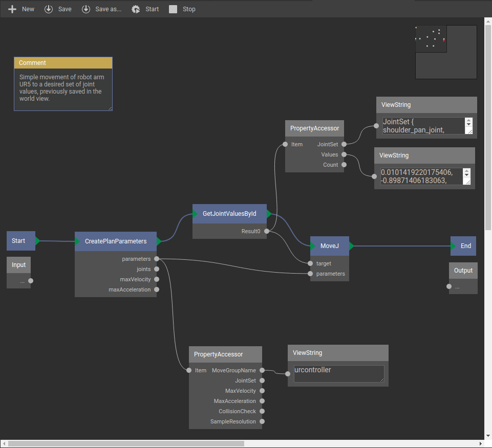

***********************
ROSVITA Graph Concept
***********************

To create a new "xgraph", click on the "+ New" button in the top bar. The graph view opens and the name of the new xgraph appears in the list of "Runtime Slots" together with its process ID (see top left edge of the ROSVITA environment). 
On the right side bar under the title "Module Catalog", you can now select individual modules and drag and drop them into the graph editor, which initially only has a "Start/Input" module and an "End/Output" module. 
Clicking with the left mouse button in the graph editor will give you a text field, with which you can search for particular modules. 
Clicking with the right mouse button in the graph editor will give you four different options: You can choose between inserting a comment, adding another module, and deleting or compiling the current graph. 
If you click on a certain module in the graph editor, a short description of this module appears at the bottom of the right side bar. By clicking on one of the input, output, or parameter pins of the module, you will get a description of the clicked pin. Right-click on a module provides the option to duplicate or delete the module. By clicking on a module pin, it is also possible to draw connections between modules or module parameters: Click on the corresponding pin and keep the mouse button pressed, drag it to another module pin and release it there. By right-clicking on a connection and selecting "Disconnect", connections between modules or their parameters can be removed.

.. note:: The triangular green module pins denote so-called "flow connections", i.e. between these pins always just one connection can be drawn. You cannot have multiple connections on a triangular pin. The round gray module pins, on the other hand, are "parallel connections", i.e. such a pin can be connected to several other pins.

Module parameter values ​​can either be entered manually in the corresponding text fields of the "Properties" pane at the right side bar, or set by a connection to another module that provides these values. To show the parameter fields of a certain module in the "Properties" pane, the corresponding module has to be clicked (see Fig. 9.1).

.. figure:: images/Graph_Editor.png

   Figure 9.1  ROSVITA Graph Editor.

Once you have finished the graph from "Start" to "End", you can save it by pressing the button "Save as..." or "Save" at the top bar of the graph editor. Moreover, you can execute the graph by clicking on the "Start" button, and stop the execution by clicking on the "Stop" button. If the execution of the graph involves a robot movement (as in the following example), then this movement can be observed in the "World View" (e.g. opened in a second browser window).

.. note:: Before executing a graph, make sure that your current robot configuration has been compiled and ROS has  been started successfully (indicated by a green "GO" with check mark at the top bar of the ROSVITA environment).

Example Graph:
==============

In the following we want to build a simple example graph, which concretely illustrates the graph concept. This graph is designed to cause the robot (here a UR5 arm) to move to a specific joint angle position. We assume that in the "World View" already some joint angle positions have been stored, such that we can choose one of them as target position for the movement.

Module Selection:
-----------------

To create the example graph, we need the following modules:

* "MoveJ" (can be found in the "Module Catalog" under "Xamla"->"Robotics"->"JointPath", or directly via module search)
* "CreatePlanParameters" ("Module Catalog": "Xamla"->"Robotics"->"JointPath")
* "GetJointValuesById" ("Module Catalog": "Rosvita"->"WorldView")
* optional: "PropertyAccessor" (2x) ("Module Catalog": "Xamla")
* optional: "ViewString" (3x) ("Module Catalog": "Xamla"->"Graph"->"Controls")

With the "MoveJ" module, the robot can be moved to a specific joint angle position. This operation requires the planning parameters ("moveGroupName", "joints", "maxVelocity", ...) and the target values ​​for the joint angles. The current planning parameters are obtained with the module "CreatePlanParameters". In the property fields of this  module, only the name of the move group to be moved (e.g. "urcontroller") has to be entered. For all other planning parameters the default values ​​are automatically loaded. Target values ​​for the joint angles can be loaded with the module "GetJointValuesById": Simply enter the name of one of the joint angle configurations previously saved in the "World View" (e.g. "JointValues_1") in the field "id" of this module.

Module Connections:
-------------------

The modules configured above are now connected as follows:

**Flow connections:**

"Start" -> "CreatePlanParameters" -> "GetJointValueById" -> "MoveJ" -> "End"

**Parallel connections:**

* "CreatePlanParameters": "Parameters" -> "MoveJ": "Parameters"
* "GetJointValuesById": "Result0" -> "MoveJ": "target"

If you want to check whether the planning parameters and the target joint angles have been set correctly, add the modules "PropertyAccessor" and "ViewString" to the graph to display the name of the move group and the names and values of the joint angles (see Fig. 9.2).

Screenshot of the Example Graph:
--------------------------------

   Figure 9.2  ROSVITA Example Graph.

