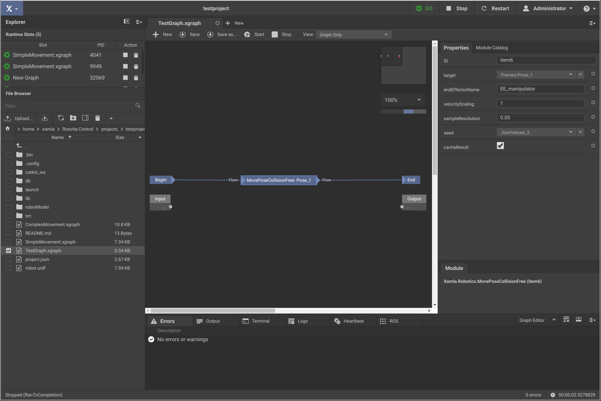
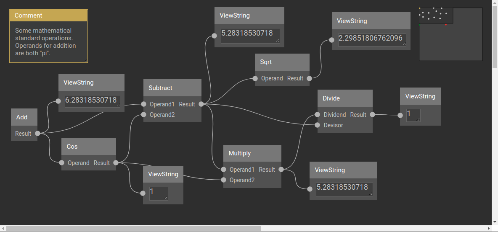
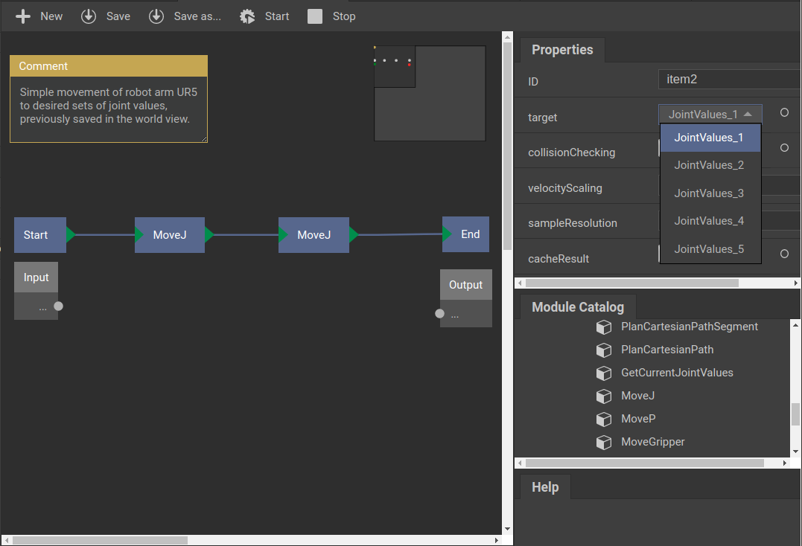
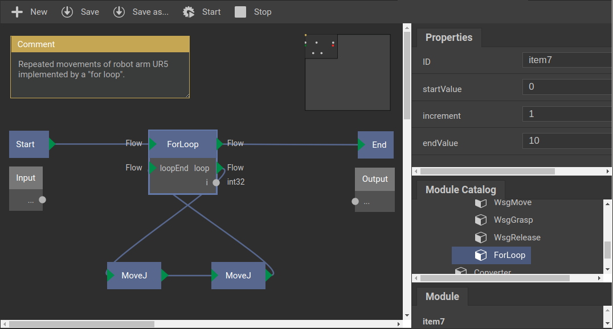

***********************
ROSVITA Graph Concept
***********************

To create a new "xgraph", click on the "+ New" button in the top bar. The graph view opens and the name of the new xgraph appears in the list of "Runtime Slots" together with its process ID (see top left edge of the ROSVITA environment). 
On the right side bar under the title "Module Catalog", you can now select individual modules and drag and drop them into the graph editor, which initially only has a "Start/Input" module and an "End/Output" module. 
Clicking with the left mouse button in the graph editor will give you a text field, with which you can search for particular modules. 
Clicking with the right mouse button in the graph editor will give you four different options: You can choose between inserting a comment, adding another module, deleting a selected element (e.g. a module, connection, comment, etc), or compiling the current graph. 
In more detail, "Compile" creates a .Net assembly (DLL) from the source code of the .Net code modules so that the functionality of the modules can be used in the runtime environment of the graph. If errors occur during compilation (e.g. syntax errors), these are displayed under "Errors" in the output area.
If you click on a certain module in the graph editor, a short description of this module appears at the bottom of the right side bar. By clicking on one of the input, output, or parameter pins of the module, you will get a description of the clicked pin. Right-click on a module provides the option to duplicate or delete the module. By clicking on a module pin, it is also possible to draw connections between modules or module parameters: Click on the corresponding pin and keep the mouse button pressed, drag it to another module pin and release it there. By right-clicking on a connection and selecting "Disconnect", connections between modules or their parameters can be removed.

.. note:: The triangular green module pins denote so-called "flow connections", i.e. between these pins always just one connection can be drawn. You cannot have multiple connections on a triangular pin. The round gray module pins, on the other hand, are "parallel connections", i.e. such a pin can be connected to several other pins.

Module parameter values ​​can either be entered manually in the corresponding text fields of the "Properties" pane at the right side bar, or set by a connection to another module that provides these values. To show the parameter fields of a certain module in the "Properties" pane, the corresponding module has to be clicked (see Fig. 9.1).

   Figure 9.1  ROSVITA Graph Editor.

Once you have finished the graph from "Start" to "End", you can save it by pressing the button "Save as..." or "Save" at the top bar of the graph editor. Moreover, you can execute the graph by clicking on the "Start" button, and stop the execution by clicking on the "Stop" button. If the execution of the graph involves a robot movement (as in some of the following examples), then this movement can be observed in the "World View" (e.g. opened in a second browser window).

.. note:: Before executing a graph, make sure that your current robot configuration has been compiled and ROS has  been started successfully (indicated by a green "GO" with check mark at the top bar of the ROSVITA environment).

Example Graphs:
===============

In the following we want to build some example graphs, which concretely illustrate the graph concept. The first of these graphs simply performs some arithmetic operations, while the second and third graph are designed to cause robot movements. 

Example Graph 1:
----------------

   Figure 9.1  ROSVITA Example Graph1 (simple arithmetic operations).

The first graph (see Fig. 9.1) simply performs some mathematical operations, like addition and multiplication of two floating point numbers. All the modules used for this graph can be found in the "Module Catalog" under "System" -> "Math", or directly via module search. 

Module Selection:
^^^^^^^^^^^^^^^^^^

To create the first example graph, we use the following modules:

* "Add" (addition of two floating point numbers)
* "Cos" (cosinus calculation)
* "Substract" (subtraction of two floating point numbers)
* "Multiply" (multiplication of two floating point numbers)
* "Divide" (division of two floation point numbers)
* "Sqrt" (square root calculation)
* "ViewString" (6x) (display of resulting numbers as string)

Operands for the first addition are both "pi" (3.14159265359) entered into the corresponding property fields ("Operand1" and "Operand2") of this module (module "Add").

Note, that here we only have parallel connections between modules (see Fig. 9.1).

Example Graph 2:
----------------

   Figure 9.2  ROSVITA Example Graph2 (simple robot movement).

The second example graph (see Fig. 9.2) is designed to cause the robot (e.g. a UR5 arm) to successively move to two different joint angle positions. We assume that in the "World View" already some joint angle positions have been stored, such that we can choose two of them as target positions for the movement.

Module Selection:
^^^^^^^^^^^^^^^^^^

To create the second example graph, we need two "MoveJ" modules, which can be found in the 
"Module Catalog" under "Xamla"->"Robotics", or directly via module search.
With the "MoveJ" module, the robot can be moved to a specific joint angle position. 
This operation explicitly requires the target values ​​for the joint angles. 
All other module parameters ("collisionChecking", "velocityScaling", "sampleResolution" and "cacheResult")
have default values.
Target values ​​for the joint angles can be selected in the "target" properties field of the module (see Fig. 9.2): Simply choose the name of one of the joint angle configurations previously saved in the "World View".

Example Graph 3:
----------------

   Figure 9.3  ROSVITA Example Graph3 (repeated robot movement implemented by a "for loop").

The third example graph (see Fig. 9.3) extends the second example graph by a for loop. Hence, running this graph causes the robot to repeat the movement from target joint position1 to target joint position2 for 11 times. As before, we assume to have some joint angle positions previously stored in the  “World View”.

Module Selection:
^^^^^^^^^^^^^^^^^^

In addition to the modules from "Example Graph2", we only need a "ForLoop" module, which can be found in the "ModuleCatalog" under "Xamla"->"Robotics". The "ForLoop" module, enables us to repeatedly execute parts of the graph (here, the two "MoveJ" commands). As parameter values it only needs a start and an end value, as well as an increment for the counting.

