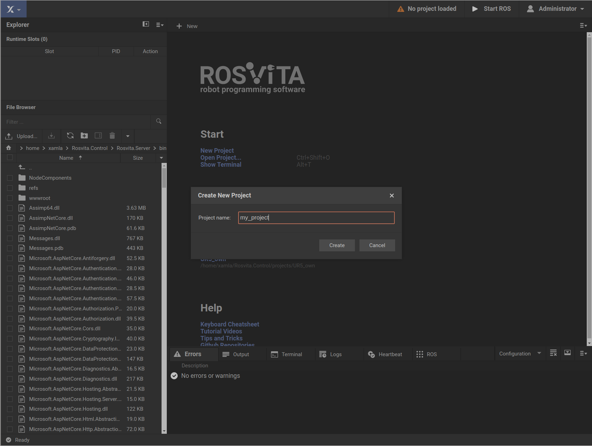
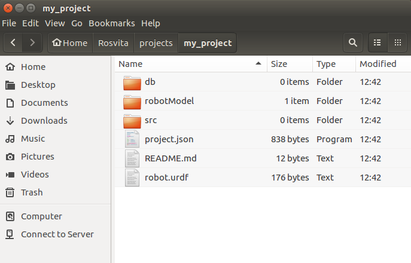

************************
Creating a New Project
************************

In the ROSVITA main development environment, by clicking on the blue-highlighted **Xamla** icon in the upper left corner, 
a selection bar appears, in which you select the menu item **New Project**.
Alternatively, you can also click on **New Project** directly in the middle of the start screen.
A text box appears in which you can enter the desired name of the project (see Fig. 2.1).

   Figure 2.1  Creation of a new project.

.. note:: Enter a name without a path here, as the path under which the project is saved is already specified in the ROSVITA start script ("rosvita_start.sh").

After clicking on the **Create** button, the project is created and opened in the integrated file browser.
Under the default path (normally ``/home/<username>/Rosvita/projects/``) 
you will find the project folder with the previously entered name.
So far it contains only empty folders ("db", "src") or files 
("robotModel/main.xacro", "robot.urdf", "project.json", "README.md"), that all contain empty structures,
which will be filled later on.

In summary the newly created project folder contains the following content (see also Fig. 2.2):

* Folder "db" (empty)
* Folder "src" (empty)
* Folder "robotModel" -> File "main.xacro" (empty structure for the robot model)
* File "robot.urdf" (empty structure for the robot model created from "main.xacro")
* File "project.json" (empty structure for the MoveIt! configuration)
* File "README.md" (empty textual description of the configuration)

   Figure 2.2  Content of the newly created project folder.

Now, we are ready for creating a new robot configuration within our just created project.
