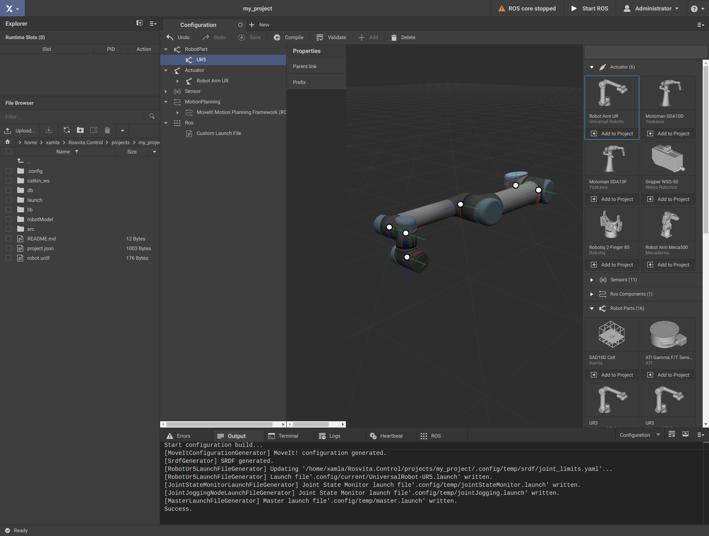

.. _robot-config-label:

********************************
Creating a Robot Configuration
********************************

When clicking on the blue-highlighted "Xamla" symbol in the top left corner and selecting the menu item "Configuration", 
a sidebar for selecting robot parts, actuators, sensors, motion planners and libraries appears on the right-hand side of 
the browser (see Fig. 3.1). 
Under the menu item "RobotParts" of this sidebar one chooses e.g. the "UR5" from Universal Robots (i.e. the corresponding URDF and 3D model). 
By clicking on the "Add to Project" button, the corresponding robot part is added to the current configuration.
Under the menu item "Actuator" choose the corresponding actuator (here: "Robot Arm UR").
The menu bar on the left of the "Configuration" view lists the individual components of the current configuration. 
If within this menu bar you click on the previously added robot part "UR5", 
the 3D model of this robot arm including all coordinate systems of the individual joints is displayed in the 3D view. 
Continuously pressing the left mouse button rotates the 3D view, sustained press of the right mouse button allows 
moving the scene in the 3D view, and scrolling the mouse wheel will zoom in or out of the 3D scene.

   Figure 3.1  Configuration View.

.. note:: A robot configuration always needs at least one "RobotPart" (Xacro/URDF robot description, 3D visualization and collision model), as well as the associated "Actuator" (robot driver).

By clicking on the "Save" button at the top bar of the "Configuration" view, the current configuration is saved 
in the current project, i.e. some of the files in the project folder created before are now filled with life.
If you previously selected the "UR5" robot arm, in the "robotModel" folder a new folder 
"part_ur5" will appear. This folder contains the visualization and the collision model of the UR5 robotic arm 
(".stl" files in the subfolder "collision" and ".dae" files in the subfolder "visual"). 
Furthermore, it contains a "part.json" file with the MoveIt! configuration of the UR5, as well as .xacro files, 
from which the URDF (Unified Robot Description Format) for the UR5 will be built. 
Finally, it includes two additional files "CMakeLists.txt" and "package.xml", 
which are needed for compiling in a "Catkin" workspace under ROS. 
The file "robotModel/main.xacro" that was already generated when the project was created, 
will now include the .xacro file of the UR5 (``xacro:include filename="part_ur5/universal_robots-ur5.xacro``).

In summary, we now have the following content in the project folder after adding and saving the UR5 robot arm:

* Folder "db" -> empty file "worldview.json"
* Folder "src" (empty)
* Folder "robotModel" ->

  * folder "part_ur5" (contains visualization and collision model, .xacro files and MoveIt! configuration of the UR5), 
  * file "main.xacro" (description of the current configuration, now including the UR5 description)

* File "robot.urdf" (description of the current configuration, now including the UR5 description)
* File "project.json" (current MoveIt! configuration, now containing the UR5 MoveIt! configuration)
* File "README.md" (empty textual description of the configuration)

To compile an existing configuration
(i.e. building the URDFs from the .xacro files and building the MoveIt! configuration),
press the "Compile" button at the top bar of the "Configuration" view.
In the "Output" terminal at the bottom of the ROSVITA environment, a message that the start configuration 
was compiled successfully (similar to the following example message) appears::

   Start configuration build...
   [MoveItConfigurationGenerator] MoveIt! configuration generated.
   [JointStateMonitorLaunchFileGenerator] Joint State Monitor launch file'.config/temp/jointStateMonitor.launch' written.
   [MasterLaunchFileGenerator] Master launch file'.config/temp/master.launch' written.
   Success.

In addition, the message "not configured" next to the warning triangle on the top right is replaced by the
message "ROS core stopped".

Now, you can start ROS by pressing the button "Start ROS" in the top bar.
The roscore, the robot_state_publisher, the move_group, the xamlaJointMonitor, and several other nodes are started.
An overview of the started processes can be obtained by clicking on the blue-highlighted Xamla symbol 
and selecting the menu item "Monitoring" there. If everything works fine, a green "GO" replaces the warning message
on the top right and the path planning can begin.

.. figure:: images/Monitoring_View.png

   Figure 3.2  Monitoring View

If instead the message "Heartbeat failure" appears next to the warning triangle,
clicking on this warning opens the overview of the system status, i.e. of all processes that have been started.
Moreover, hovering above this warning shows the status ("GO" or "NOGO") of all nodes. This individual node status can also be seen when looking at the heartbeat output in the bottom pane.  
By clicking on the "Restart" button in the top bar, which now replaces the "Start ROS" button, ROS will be restarted. 
If that does not resolve the warning message, you can also restart individual crashed processes in the 
"Managed Process List" by clicking the "Start" button next to the corresponding process. 
In addition, the outputs and error messages of all started processes can be viewed in detail in the current system status
("Monitoring") view. Often, also the "Logs" output pane gives helpful indications of failure causes.

