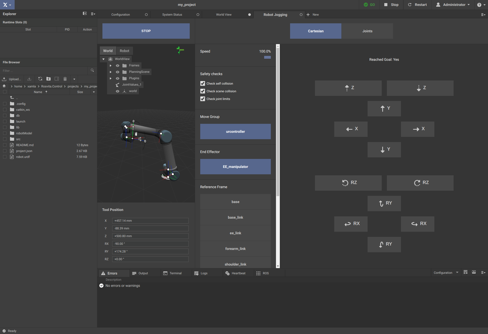
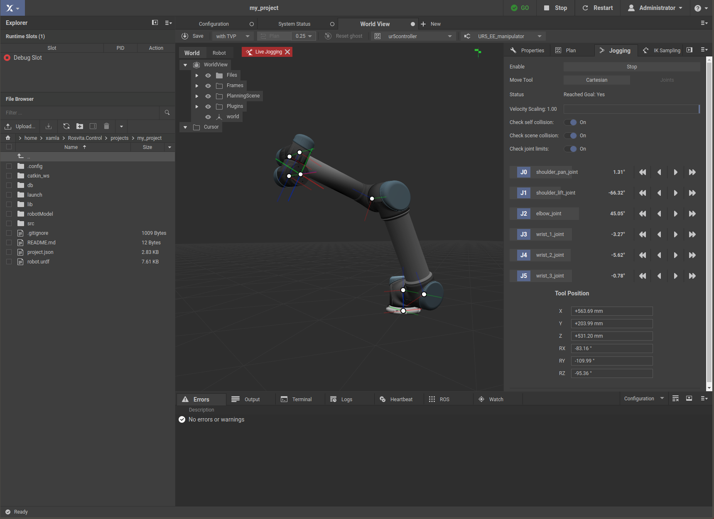

****************
Robot Jogging
****************

In addition to automatic path planning, ROSVITA also offers the possibility of manual, step-by-step control of the robot movement (comparable to the robot control via "teach pendant"). Click on the blue-highlighted Xamla symbol and select the menu item "Robot Jogging" to switch to the view for manual, step-by-step control of the robot movement. The current robot configuration appears in a 3D view. Underneath the 3D view you find a display of the current "Tool Position", which is updated in real-time as the robot moves. To the right of the 3D view is a bar where you can set the speed, the "Move Group" to be controlled, the "End Effector" being moved, and the "Reference Frame" for the driving commands. To the right of this bar is a control panel with the buttons for the driving commands. By selecting the "Cartesian" robot control in the top bar of the "Robot Jogging" view, 12 driving command buttons appear in the control panel, namely translation in +/- x, y, and z direction, as well as rotation around +/- x, y, and z axis of the reference coordinate system (see Fig. 5.1). After pressing the "Start" button in the upper bar, the robot moves as soon as you click on one of the driving commands in the control panel. When the Cartesian robot jogging is selected, the interactive marker for moving the robot is also available.

   Figure 5.1  Cartesian robot jogging.

Alternatively, instead of choosing the Cartesian robot control, one can also select the control of the individual joint angles ("joints") at the top bar. The control panel will then show the joints of the selected "Move Group" along with the current joint angle for each joint. When the "Start" field is pressed, "Left / Right arrows appear next to each joint, allowing you to rotate gradually around the corresponding joint.

   Figure 5.2  Robot jogging via joints.
