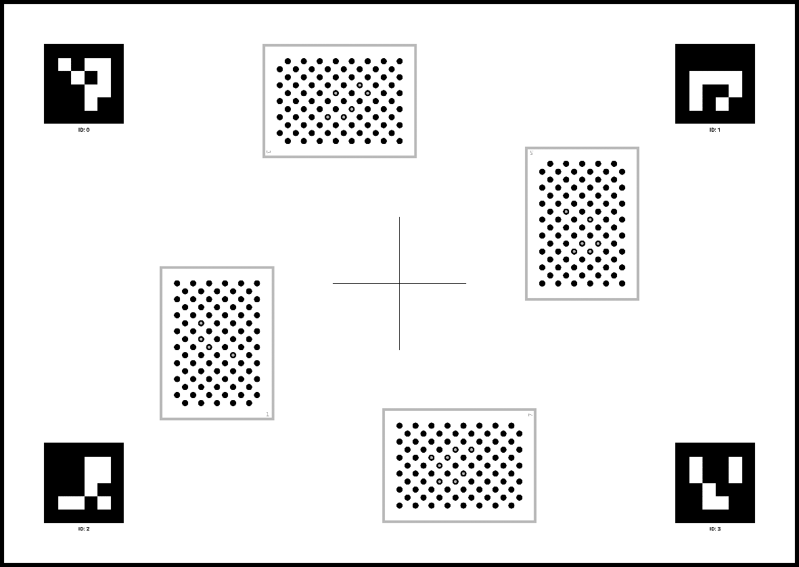
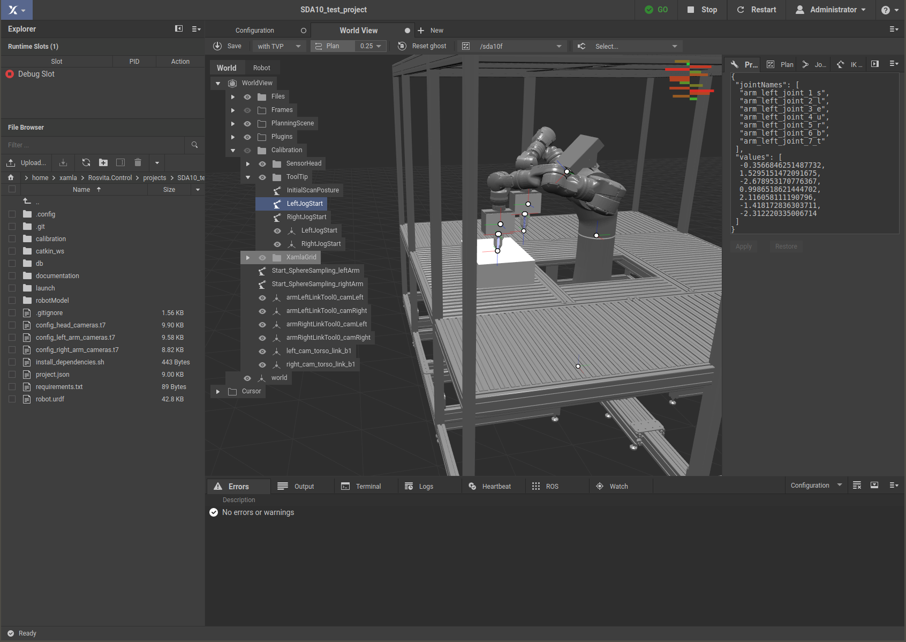

.. _calibration-part1-label:

**************************************************
Calibration Part1 (Camera, Hand-Eye, Endeffector)
**************************************************

The Rosvita package **auto_calibration** (``/home/xamla/Rosvita.Control/lua/auto_calibration``)
containts scripts for camera and hand-eye calibration, including data acquisition.
It is almost completely written in LUA, except for the current endeffector calibration 
(subfolder ``endEffectorCalibration_py``), which is written in Python.

**Major features are:**

1. :ref:`camera-calibration-label` (single and stereo setup) including data acquisition
2. :ref:`hand-eye-calibration-label` Hand-Eye calibration (including evaluation)
3. :ref:`endeffector-calibration-label`

**Calibration pattern requirements:**

For all camera and hand-eye calibrations one of our |Circle_Pattern_link| 
(see also ``/home/xamla/Rosvita.Control/lua/auto_calibration/Patterns_with_ID.pdf``) has to be used.
For a high-quality print of one of these patterns contact us (http://xamla.com).

.. _camera-calibration-label:

Camera calibration
-------------------

Calibration of Ximea cameras or GenICam based cameras as single or stereo camera setup mounted onboard (on the robot) or extern can easily be performed by running the scripts **configureCalibration.lua** and **runCalibration.lua**.

In more detail, the **calibration pipeline** is as follows:

* In Rosvita load or create a project (e.g. with UR5 or SDA10, cameras and gripper), compile it and start ROS.
* With the Rosvita terminal go into your project folder and start the configuration script:

.. code-block:: bash

   cd /home/xamla/Rosvita.Control/projects/<your_project_folder>
   th /home/xamla/Rosvita.Control/lua/auto_calibration/configureCalibration.lua

* -> The **configuration main menu** will appear in the terminal.

   * Now you can select the calibration mode (single or stereo camera setup), the robot move group, the camera type, the circle pattern id and geometry, etc. ...  
   * Moreover, you can teach base poses, capture poses and optionally evaluation poses for the calibration. 
   * **Hint**: Base Poses are mainly used for picking a calibration target. If you don't want to pick a calibration target, only teach a start pose and successively press return afterwards for the remaining base poses.
   * Don't forget to **save** the configuration by **pressing the 's' button**.

* Next run the calibration script from your project folder and with the previously saved configuration: 

.. code-block:: bash

   th /home/xamla/Rosvita.Control/lua/auto_calibration/runCalibration.lua -cfg <name_of_your_saved_configuration_file>.t7

* -> The **calibration main menu** will appear in the terminal.

   * Now, simply press:

      * f (Full calibraton cycle)  

   * or press the following sequence:

      * c (Capture calibration images)
      * a (Calibrate camera)
      * s (Save calibration)
      * b (Hand-eye calibration)
      * e (Evaluate calibration) (optionally)

* The order of this sequence is important, in particular don't forget to save the camera calibration by pressing 's' before starting the hand-eye calibration.

.. note:: The output directory for your calibration data (image capturing and calibration results) will be ``/tmp/calibration/<date>_<time>/``. Thus, your calibration data will be saved only temporarily. To permanently save calibration results, move them into your project folder!

.. _hand-eye-calibration-label:

Hand-eye calibration
---------------------

In case of an **onboard camera setup**, the hand-eye calibration detects the transformation (rotation and translation) between the tool center point (tcp) of the robot and a previously calibrated camera system mounted on the robot.

In case of an **extern camera setup**, the calibration pattern has to be mounted on the robot (e.g. grasped by the gripper) and the hand-eye calibration detects the transformation between the tcp and the pattern.

To be able to perform hand-eye calibration, the camera calibration has to be performed and saved first (see above).
To run the hand-eye calibration, type the following commands into the Rosvita terminal:

.. code-block:: bash

   cd /home/xamla/Rosvita.Control/projects/<your_project_folder>
   th /home/xamla/Rosvita.Control/lua/auto_calibration/runCalibration.lua -cfg <name_of_your_saved_configuration_file>.t7

Then press

* b (Hand-eye calibration)

Now, you have to enter the name of the folder (``<date>_<time>``) containing your recorded robot poses and the name of the folder containing the camera calibration (probably the same).

Moveover you have to choose if you want to use **RANSAC outlier removal**:

.. code-block:: bash

   1 with RANSAC outlier removal
   2 without RANSAC outlier removal

In particular with large datasets (e.g. obtained via sphere sampling) it is highly recommended to use option 1 (with RANSAC outlier removal), because outlier removal considerably stabilizes the underlying hand-eye calibration algorithm, which is the closed-form solution proposed by |Tsai_Lenz_link|.

Finally, you may want to evaluate your hand-eye calibration by some error metrics to be able to compare it with alternative hand-eye calibrations. Thereto, first you have to teach some tcp poses for evaluation (such that the cameras can capture the pattern from different angles and positions):

.. code-block:: bash

   th /home/xamla/Rosvita.Control/lua/auto_calibration/configureCalibration.lua
   * e (Teach poses for evaluation)

**Some notes about the calibration result folder structure:**

* Captured images will be stored in ``/tmp/calibration/capture/``
* Robot poses will be stored in ``/tmp/calibration/<date>_<time>/jsposes.t7``
* Stereo calibration will be stored in ``/tmp/calibration/<date>_<time>/stereo_cams_<serial1>_<serial2>.t7``
* For a single camera setup, camera calibration will be stored in ``/tmp/calibration/<date>_<time>/cam_<serial>.t7``
* For an extern stereo setup, hand-pattern calibration will be stored in ``/tmp/calibration/<date>_<time>/HandPattern.t7``, and moreover the pose of the left camera relative to the robot base will be stored in ``/tmp/calibration/<date>_<time>/LeftCamBase.t7``
* For an on-board stereo setup, hand-eye (with 'eye' = left cam) calibration will be stored in ``/tmp/calibration/<date>_<time>/HandEye.t7``, and moreover the pose of the pattern relative to the robot base will be stored in ``/tmp/calibration/<date>_<time>/PatternBase.t7``

.. note:: In order to save disk space and to not get confused with too many calibration results, this storage is only a temporary one. That means, all calibration results, image capturings and pose recordings will get lost if the Rosvita image is stopped. To permanently save the best calibration result, move the corresponding folder into your project folder.

.. _endeffector-calibration-label:

End effector calibration
------------------------

.. note:: The end effector calibration described here, is tested for the SDA10 robot. For usage with an UR5 or other robots, slight adaptions to the scripts might be necessary. Moreover, note that the end effector calibration is the last step of the calibration pipeline. Thus before calibrating the end effector, you first have to perform the camera calibration, hand-eye calibration and (if necessary) the robot kinematic calibration.

**End effector calibration pattern requirements:**

For the end effector (tooltip) calibration our |Tooltip_Pattern_link| 
(see also ``Pattern_for_tooltip_calibration.pdf`` in subfolder ``endEffectorCalibration_py`` of 
``/home/xamla/Rosvita.Control/lua/auto_calibration``) has to be used.
It is recommended to print this pattern in A4 format.
For a high-quality print of this pattern contact us (http://xamla.com).

   Figure 15.1  Pattern for end effector (tooltip) calibration.

**End effector calibration:**

First, you have to define a good **starting pose** for the robot, such that e.g. a stereo camera setup mounted at the SDA10 torso can capture the whole calibration pattern, which is fixed onto the table (or onto a resilient plate). In particular, **all four circle patterns** must be **completely visible** in the left and right image.
Save this starting pose of the robot to the Rosvita world view and move the robot to this posture before starting the tooltip calibration.

Now, with the Rosvita terminal go into your project folder and call the **run_tooltip_calibration.py** script from the auto_calibration package:

.. code-block:: bash

   cd /home/xamla/Rosvita.Control/projects/<your_project_folder>
   python3 ../../lua/auto_calibration/endEffectorCalibration_py/run_tooltip_calibration.py

The script will ask you to enter the filename (with path) of the stereo camera calibration (here, this is the stereo camera calibration of the SDA10 torso cameras). Next, it will ask you for the exposure time of the cameras, the robot arm with the end effector to be calibrated, and the hand-eye for the torso cameras (i.e. the file containing the transformation between the torso joint and the torso cameras; you may simply press \'Enter\' here).
After that, you have to move the robot to the starting pose (if not already done) and again press 'Enter'.

With help of the four circle patterns, which have their origin at the elongation of the cross lines, the position of the cross lines can be determined in world coordinates. The pattern poses in camera and world coordinates, as well as the resulting position of the cross lines will be written into the terminal output.

Finally, you are asked to move the tooltip straight down to the cross lines. Make sure, that the tooltip points straight down, i.e. in direction of the table, and precisely touches the middle of the crosslines (see Fig. 15.2). Then confirm this by pressing 'Enter'. Now, the pose of the tooltip is the same as the pose of the cross lines. With help of the known flange (TCP) coordinates the tooltip pose is transformed into flange coordinates and the result is written into the terminal output and saved as ``/tmp/calibration/storage_tooltipcalib/tooltip_pose_in_flange_coordinages.npy``.

   Figure 15.2  End effector (tooltip) calibration.

To **relocate the tool center point (TCP)** from the flange position to a newly calculated end effector (tooltip) position in Rosvita, add a **tcp_link** to the file **robotModel/main.xacro** of your project folder. As **origin xyz** of your new tcp_link choose the **translation vector of** your calculated **tcp<->end effector transformation** (i.e. of your tooltip pose in flange coordinates). Then compile the **main.xacro** and adapt your robot configuration (i.e. the **tip link** of the move group and the **parent link** of the end effector). For more details see chapter :ref:`relocation-of-tcp-label` or see the last terminal output when running the script.

.. |Circle_Pattern_link| raw:: html

   <a href="https://github.com/Xamla/auto_calibration/blob/master/Patterns_with_ID.pdf" target="_blank">circle patterns with ids</a>

.. |Tsai_Lenz_link| raw:: html

   <a href="https://pdfs.semanticscholar.org/19b3/89a797a55c8b63dca8b6d1889df4cff8bfaa.pdf" target="_blank">R. Y. Tsai and R. K. Lenz</a>

.. |Tooltip_Pattern_link| raw:: html

   <a href="https://github.com/Xamla/auto_calibration/blob/master/endEffectorCalibration_py/Pattern_for_tooltip_calibration.pdf" target="_blank">pattern arrangement with crosslines</a>
