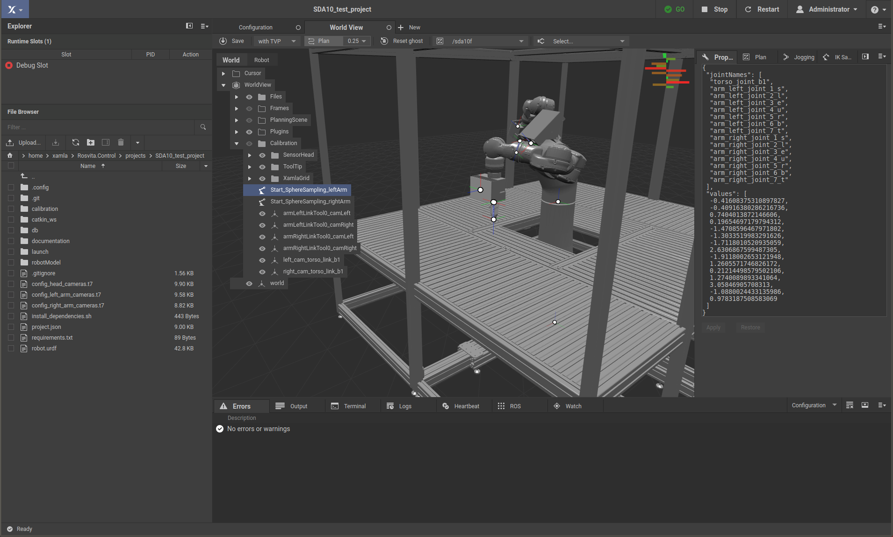

.. _calibration-part2-label:

************************************
Calibration Part2 (Robot Kinematic)
************************************

The Rosvita package **egomo_calibration** (``/home/xamla/git/egomo_calibration``)
containts scripts for robot calibration and hand-eye optimization.
It is written in Python and C++ and uses |Ceres_link| to optimize the robot kinematic 
modelled by |Denavit-Hartenberg_link|.

.. note:: The robot kinematic calibration described here, has been used to calibrate an SDA10 robot. For usage with an UR5 or other robots, some adaptions to the scripts will be necessary.

**Calibration pattern requirements:**

For all camera and hand-eye calibrations one of our circle patterns with IDs
(``/home/xamla/Rosvita.Control/lua/auto_calibration/Patterns_with_ID.pdf``) has to be used.
See :ref:`calibration-patterns-label`

.. _sphere-sampling-label:

Capturing calibration data via automatic sphere sampling
--------------------------------------------------------

Automatic sphere sampling is performed via the **auto_calibration** package of Rosvita (see :ref:`calibration-part1-label`).

To use the automatic sphere sampling, you first have to define a good **starting pose** for the robot arm that will be calibrated. In the following, let us assume a stereo camera setup with the cameras mounted at the endeffector of the robot arm and looking in the direction of the z-axis of the endeffector. With this setup the calibration target has to be fixed onto the table and the robot has to be moved to a pose where the cameras look down at the target approximately straight from above and such that all target points are in the field of view (FOV) of the cameras (see Fig. 16.1). Save this starting pose of the robot (or better the joint values) to the Rosvita world view and move the robot to this posture before starting the sphere sampling.

   Figure 16.1  Starting pose for sphere sampling with left arm.

Moveover, an initial guess hand-eye and stereo camera calibration is needed, which can be received e.g. by running the **auto_calibration** scripts **configureCalibration.lua** and **runCalibration.lua** (see :ref:`calibration-part1-label`). 

Now, to start the sphere sampling, with the Rosvita terminal go into your project folder and run the configuration script from the **auto_calibration** package:

.. code-block:: bash

   cd /home/xamla/Rosvita.Control/projects/<your_project_folder>
   th ../../lua/auto_calibration/configureCalibration.lua -cfg <name_of_your_configuration_file>.t7

Here, the configuration file is the one you created before to get an initial hand-eye and stereo camera calibration (see previous chapter).

Then press

.. code-block:: bash

   a (Generate capture poses via sphere sampling)

You'll have to choose the camera setup. Currently, two possibilities are implemented:

.. code-block:: bash

   e end-of-arm camera setup
   t torso camera setup

Choose the option e (end-of-arm camera setup).

After that, you have to enter the number of capture poses you want to sample. 
In order to obtain good calibration results, you should choose a rather large number of about 100-200 poses.

Next you have to enter the paths to the previously generated intial guesses for the hand-eye calibration and stereo camera calibration (e.g. ``<path-to-your-project-folder>/calibration/<date>_<time>/HandEye.t7`` and ``<path-to-your-project-folder>/calibration/<date>_<time>/stereo_cams_<serial1>_<serial2>.t7``). Then after accepting the **identified target point** by pressing **enter** the sphere sampling will begin, i.e. the robot will start moving and recording images and poses.

.. note:: Make sure, that all **collision objects** in your robot's work space are **modeled carefully** (with safety margin), before starting the sphere sampling. The **robot will move relatively fast** using MoveIt! and collision check. However, collisions can only be avoided for correctly modeled collision objects.

Further preparation of the calibration input data
--------------------------------------------------

**Sphere sampling output folder structure**

Now, you have to prepare your data obtained from the sphere sampling for the robot kinematic calibration task.

After the sphere sampling is finished the data lies in the folder ``/tmp/calibration/capture_sphere_sampling/``. 
This folder contains the following files:

* The 100-200 captured images of the calibration target for camera 1 and 2 (cam_<serial1>_001.png, ..., cam_<serial1>_200.png, cam_<serial2>_001.png, ..., cam_<serial2>_200.png)
* The robot poses and joint configurations of the relevant move group (jsposes.t7, jsposes_tensors.t7)
* The starting pose and joint configuration of the complete robot (all_vals.t7, all_vals_tensors.t7)
  (This is only needed to obtain the static torso position, if the torso is not moved, i.e. does not belong to the relevant move group.)
  
.. note:: The **/tmp** location is a **temporary** one. If you want to save your sphere sampling data permanently, you have to move it e.g. into your project folder!

**Improvement of stereo camera and hand-eye input data**

Now, with the 200 sampled images and robot poses, you first should determine an improved stereo calibration, as well as an improved initial hand-eye matrix. Thereto, simply copy the captured images into a folder ``/tmp/calibration/capture/`` and run the camera and hand-eye calibration of the package **auto_calibration** (see :ref:`calibration-part1-label`):

.. code-block:: bash

   cd /tmp/calibration/; mkdir capture
   cp -r capture_sphere_sampling/*.png capture/
   cd /home/xamla/Rosvita.Control/projects/<your-project-folder>/
   th ../../lua/auto_calibration/runCalibration.lua -cfg <your_configuration_file>.t7
   a (Calibrate camera)
   s (Save calibration)
   b (Hand-eye calibration)

When you have to enter the name of the folder containing the **jsposes.t7** file, type 
``capture_sphere_sampling``.

Finally, move the results of this calibration into the sphere sampling output folder:

.. code-block:: bash

   mv /tmp/calibration/<date>_<time>/stereo_cams_<serial1>_<serial2>.t7 /tmp/calibration/capture_sphere_sampling/
   mv /tmp/calibration/<date>_<time>/HandEye.t7 /tmp/calibration/capture_sphere_sampling/

**Data conversion**

The egomo_calibration algorighm is written in Python and needs numpy arrays (.npy files) as input files. 
Thus, you have to convert the lua .t7 files into the .npy format. 
To do this, use the script ``/home/xamla/git/egomo_calibration/examples/run_data_conversion.sh``, 
i.e. adapt the camera serials within this script, then go into your data folder (``capture_sphere_sampling``) 
and call the script from there:

.. code-block:: bash

   cd /tmp/calibration/capture_sphere_sampling/
   /home/xamla/git/egomo_calibration/examples/run_data_conversion.sh

.. _robot-kinematic-calibration-label:

Robot kinematic calibration
----------------------------

Now, you can run the robot kinematic calibration with the previously captured and prepared input data.
Thereto, first adapt the corresponding start script 
(``/home/xamla/git/egomo_calibration/examples/run_dh_calib_motoman_end_of_arm_cameras.sh`` or 
``/home/xamla/git/egomo_calibration/examples/run_dh_calib_motoman_end_of_arm_cameras_v2.sh``), i.e.
you have to adapt the paths to your input data, the number of captured images, the ID of the used circle pattern,
the output file names, the parameters you want to optimize, etc. 
A detailed list of these input arguments is given at the beginning of the start script.

.. note:: The argument **alternating optimization** means that DH-parameters and hand-eye are repeatedly optimized after each other. Thus this argument should only be **True**, if **optimize hand-eye** is set to **True**. Moreover, **with_torso_optimization** should only be set to **True**, if **with_torso_movement_in_data** is also **True**, because if there is no torso movement within the data, the torso joint cannot be optimized.

Next, with the terminal go into the folder containing the start script and call the script from there:

.. code-block:: bash

   cd /home/xamla/git/egomo_calibration/examples/
   ./run_dh_calib_motoman_end_of_arm_cameras.sh

or:

.. code-block:: bash

   ./run_dh_calib_motoman_end_of_arm_cameras_v2.sh

The **first variant** uses an average of the 3d circle pattern as initial guess. In more detail, for each stereo image pair the 3-dimensional pattern points in camera coordinates are calculated by triangulation and transformed into base coordinates by multiplication with the robot pose and hand-eye matrix. Then each 3d circle point position is averaged for all ~200 captured image pairs and the resulting average circle point pattern is taken as ground truth for calculating the reprojection error. In the reprojection error calculation each observed 2d pattern point is compared to the corresponding ground truth pattern point, which is the previously calculated average 3d pattern point projected back into 2d by using the current hand-eye and robot kinematic. (Note, that by setting **optimize points** to **True**, the averaged pattern points will also be optimized.)

The **second variant (v2)** calculates the reprojection error by comparing each circle pattern point with each other circle pattern point at the same position in the pattern for all ~200 images. Pattern points are in 3d and transformed into base coordinates with help of the current hand-eye and robot kinematic. This second variant should be **more precise**, but also takes **more time**.

As result, the program writes the optimized robot model and hand-eye into .npy files. Moreover, an urdf with the optimized values is written into **calibration_result.urdf**. **Copy** this **urdf into your current project** then close and **reopen** your **project** to apply the optimized values of the new urdf. Moreover, **publish** the **optimized hand-eye** into the Rosvita World View, i.e. with the Rosvita terminal go into your project folder and run the following **publish_hand_eye.py** script:

.. code-block:: bash

   cd /home/xamla/Rosvita.Control/projects/<your_project_folder>
   python3 /home/xamla/git/egomo_calibration/examples/publish_hand_eye.py

You will have to enter the name (with path) of the optimized hand-eye and to choose the corresponding robot arm.
As a result, the optimized hand-eye will be published into the Rosvita World View folder "Calibration" (create this folder previously, if not already existing).

.. |Ceres_link| raw:: html

   <a href="http://ceres-solver.org/" target="_blank">Ceres</a>

.. |Denavit-Hartenberg_link| raw:: html

   <a href="https://en.wikipedia.org/wiki/Denavit%E2%80%93Hartenberg_parameters" target="_blank">Denavit-Hartenberg parameters</a>

.. |Circle_Pattern_link| raw:: html

   <a href="https://github.com/Xamla/auto_calibration/blob/master/Patterns_with_ID.pdf" target="_blank">circle patterns with ids</a>

