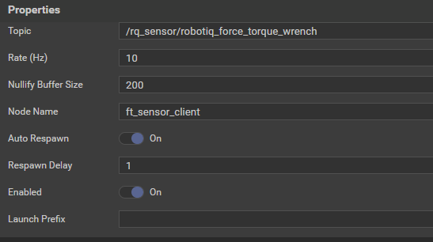
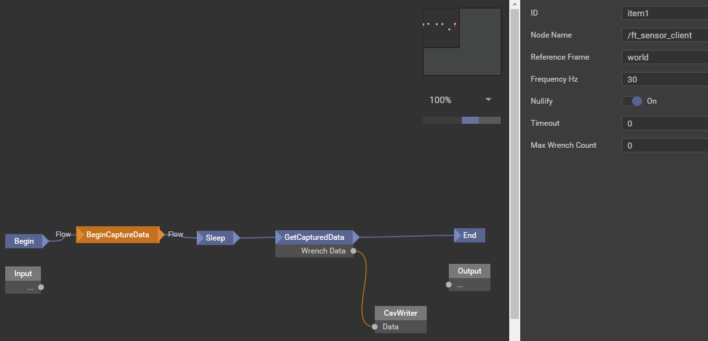

*****************
Force Torque Data
*****************

For collecting force torque data in XGraph workflows Rosvita comes with the so called ForceTorqueToolbox. The toolbox
consists of a ROS node responsible for collecting data from a force torque sensor, as well as a set of graph modules for
retrieving the data from the collecting node.

Configuration
---------------
For using force torque within a Rosvita project at least one force torque sensor has to be added to the project. Open the
Configuration view from the Xamla Menu and search in the right sidebar for the force torque sensor that you are using.
Remember to set the Frame ID (default: tool0) to the name of the link at which the sensor is attached to.

To use the data collection ROS node in a project it needs to be added to the project. To do that open the Configuration
view from the Xamla Menu and search for 'Force Torque Toolbox' in the category 'Ros Components' of the sidebar on the
right side. Click 'Add to project' to add the toolbox to the project.

.. _force_torque-toolbox-config-label:

   Figure 20.1  Configuration view of Force Torque Toolbox.

The collection node connects to a topic where the force torque sensor is publishing its data. **Therefore it is essential
to configure the correct topic in the properties of the collection node.**

The topics for the supported force torque sensors are (in their default configuration):

* ATI: /xamla/ati_driver/raw_world
* Optoforce: /xamla/optoforce_driver/optoforce_ft/ethdaq_data_raw
* Robotiq: /rq_sensor/robotiq_force_torque_wrench

The **Node Name** (default: ft_sensor_client) needs to be changed when more than one collection node is being used. The
name will be used workflow to define from which sensor the data should be fetched.

The **Rate** or idle rate defines the timeout while waiting for a ros callback.

The **Nullify Buffer Size** defines how many wrench datapoints should be stored and used to nullify the sensor.

Workflow
_______________
Example of retrieving force torque data within a workflow:

.. _force_torque-toolbox-workflow-label:

   Figure 20.2  Configuration view of Force Torque Toolbox.

The BeginDataCollection module lets the collection node begin with recording force torque sensor data. It has the
following properties:

* Frequency: in Hz of the capturing process. If > 0, reads maximum of one datapoint every timeslot defined by frequency and discards further datapoints in the same timeslot. If < 0, passes all datapoints through.
* Reference Frame: The target reference frame. Both this frame and the frame in the header of the incoming WrenchStamped-datapoints need to exist.
* Timeout: The maximum time duration the node should capture data. Captures indefinitely when duration is 0.
* Max Wrench Count: The maximum amount of wrenches to be captured. Captures indefinitely when set to 0.
* Nullify: When true, uses the average of the buffered datapoints to update the bias of the datapoints captured. Setting this to false can be helpful when doing multiple consecutive readings without wanting to reset the bias. **Even if this is false, the current stored bias is applied to the datapoints. Use the Nullify module with sampleSize set to 0 to reset the bias.**

The GetCapturedData module ends the data collection and returns the accumulated amount of data points as an array of ´
`WrenchStamped` points. The only property it needs is the Node Name of the collection node (defined during configuration) from which it should retrieve the data.

The CsvWriter module writes the collected force torque data into a CSV file. It needs at least a file path defined to which the data will be written.