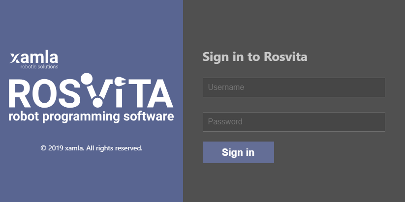
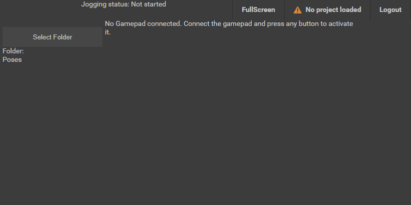
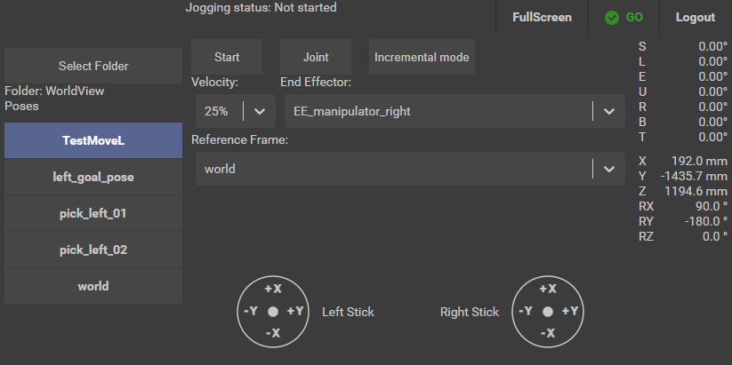
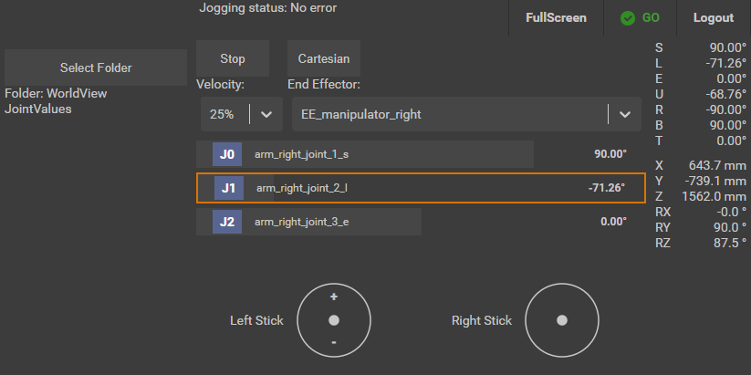
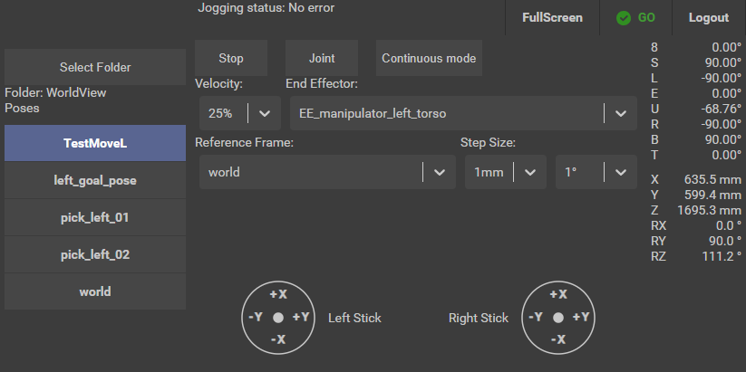
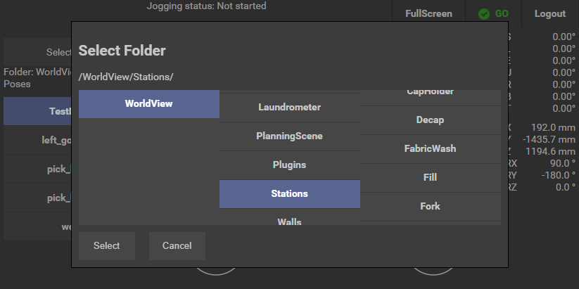
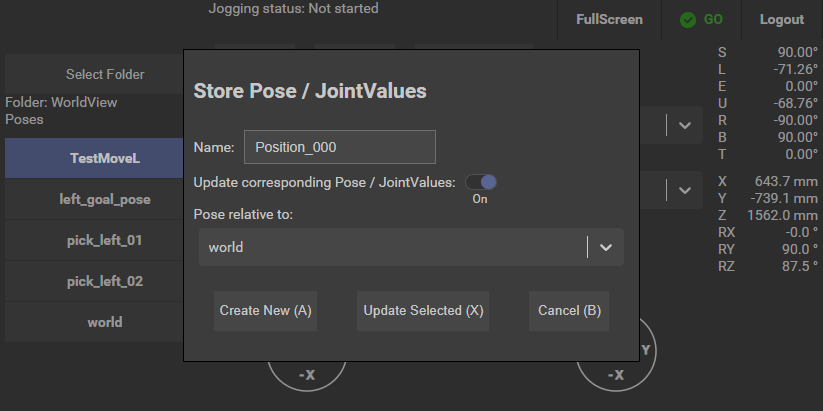

*****************
Gamepad Teaching
*****************

Rosvita comes with a special user interface for mobile devices to ease the teaching of poses and postures. By using a
mobile device in combination with a Gamepad one is able to move around the robot while still being able to use the robot
jogging function.

Requirements
---------------
To use the mobile interface the following components are needed:

- a Tablet or a Smartphone
- a Gamepad which can be connected to the Tablet / Smartphone via cable or Bluetooth

For Tablets we recommend a Windows Surface with the an i7 CPU. For Smartphones any recent upper-middleclass 6 inch Android
device can be used. When a Smartphone is used we recommend a Gamepad that can hold the Smartphone, so that it is not required
to carry around two devices. The `"Raiju Mobile" <https://www.razer.com/gaming-controllers/razer-raiju-mobile>`_ Gamepad has
been used during development and has proven itself as a solid Gamepad.

Getting Started
-----------------
Open Chrome on your mobile device and enter the URL http://<your Rosvita computer name>:5000/teach into the address bar.
You are welcomed by the Rosvita login screen:

   Figure 22.1  Rosvita mobile login screen

Enter your regular login credentials and press Sign In.

In the following screen you will notice that the Gamepad is not connected yet.

   Figure 22.2  No Gamepad connected

The browser cannot detect the Gamepad until a button pressed. Connect your Gamepad via Bluetooth or cable and press a button.
The screen changes to this:

   Figure 22.3  Idle

Now is a good time to press the Fullscreen button to have more space for the numerous controls. On Android the full screen view
can be left by pressing the back button.

The Controls
-----------------
The screen is separated into three areas. On the very left you see the current WorldView folder and which Poses or
Postures it contains. The view shows Poses when cartesian jogging is active and postures when joint jogging is active.

On the very right you see the current positions of the joints of the selected movegroup as well as the position of the
current end effector in world coordinates.

In the middle you can activate jogging and change the jogging configuration. The Start button activates the
Rosvita Jogging Node, which allows the robot to move. This can also be activate by pressing both trigger buttons
(usually named RT and LT or R2 and L2) simultaneously and hold them for two seconds. When the jogging is active the 'B'
button can be used to stop the jogging node.

The three drop down boxes allow changing the jogging speed (velocity scaling), the end effector that is used for
jogging and in which reference frame the jogging is taking place.

The actual robot movement is controlled with the joystick (analog sticks) of the Gamepad. The more the joystick is pressed
into one direction the faster the robot moves into that direction. In cartesian mode the left stick controls the
translation and the right stick controls the rotational movement. On the bottom it is indicated which
axis of the end effector is controlled by pressing the joystick into a direction. For example in figure 22.3 the end
effector is moved along the positive X-axis by pressing the left joystick upwards. By pressing the right joystick left
the robot is rotated around the Y-axis in negative direction. To switch between the X/Y-axis and the Z-axis press onto
the joystick.

Joint Jogging
------------------
Pressing the Joint button in the middle activates joint jogging. To switch back to cartesian jogging press Cartesian.

   Figure 22.4  Joint jogging

In this mode the left joystick is used to control the movement of a single joint. Pressing the left joystick up moves
the joint into the positive direction and pressing it down moves the joint into the negative direction. Which joint is
controlled can be changed with the Up and Down key of the D-Pad (the cross).

Incremental Jogging
-------------------
Incremental jogging can be activated by pressing the Incremental mode button while being in cartesian mode. To switch back
to continuous mode press the Continuous mode button.

   Figure 22.5  Incremental joint jogging

Incremental jogging means that the end effector is only moved a certain amount (e.g. 1 mm or 0.1°) when the joystick is
pressed into a direction. The robot keeps moving as long as the joystick is pressed but stops when reaching the configured
distance. Only when the joystick is released, i.e. moved back to its zero position in the middle, the next step can be
performed.

What this does is moving a target position for the end effector while the robot is trying to reach the target position.
This means that if the robot should move 3mm into one direction it is possible to fast press and release the joystick 2
times into that direction and then press and hold the joystick during the third push.

Select Folder
---------------
Press Select Folder on the left side of the screen. The following dialog opens:

   Figure 22.5  Select folder

The dialog allows to navigate through the WorldView folders. By selecting a folder on the very right sight of the dialog
another panel appears with the subfolders of the selected folder, if it has any. Press Select once you have found the
desired folder or Cancel if you do not want to change the current folder.

Store Poses / Postures
----------------------
To store the current pose of the end effector and simultaneously also the current posture of the current movegroup press
the 'A' button. This opens the dialog as seen in figure 22.6.

   Figure 22.6  Store pose/posture dialog

The store dialog stores or updates poses and postures in the currently selected folder. The name for the pose / posture
can be changed in the name textbox. When the 'Update corresponding Pose / JointValues' toggle is turned of only a pose
or a posture is stored depending in which mode the jogging is. For example if joint jogging is active and the toggle is
turned of only a posture is saved into the current folder. Pressing Update Selected will overwrite the selected pose / posture
which the current values from the robot.

It is possible to control this dialog via the Gamepad buttons. Use A to store, X to update or B to close the dialog.
