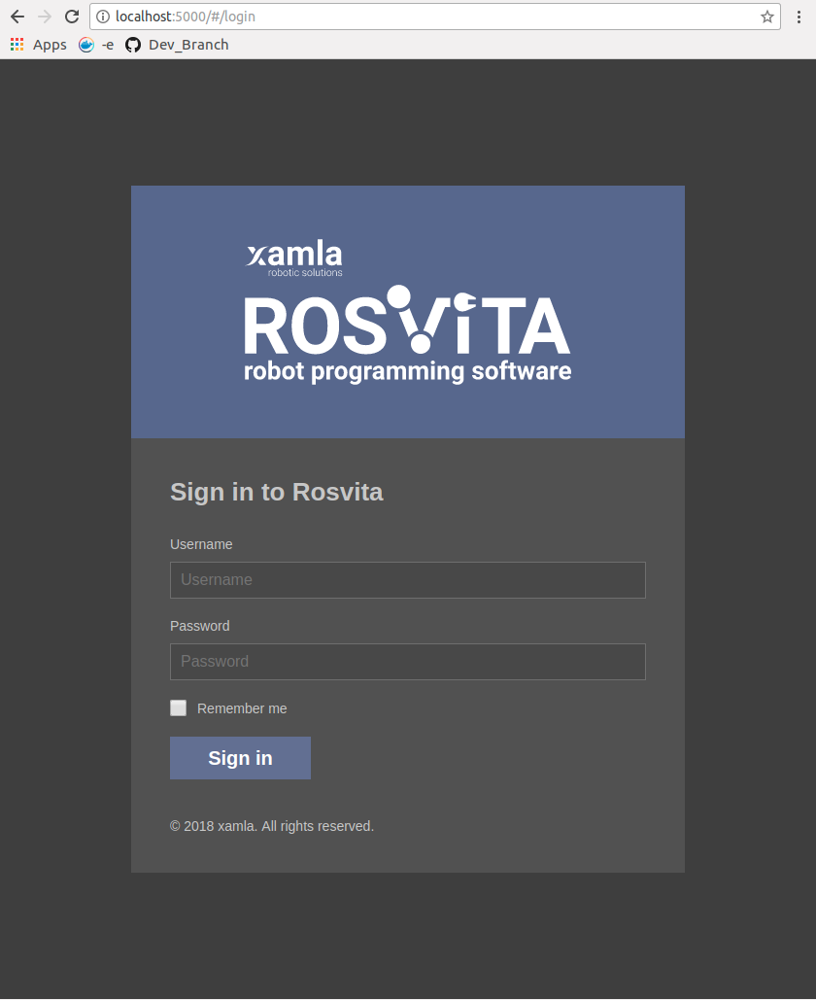
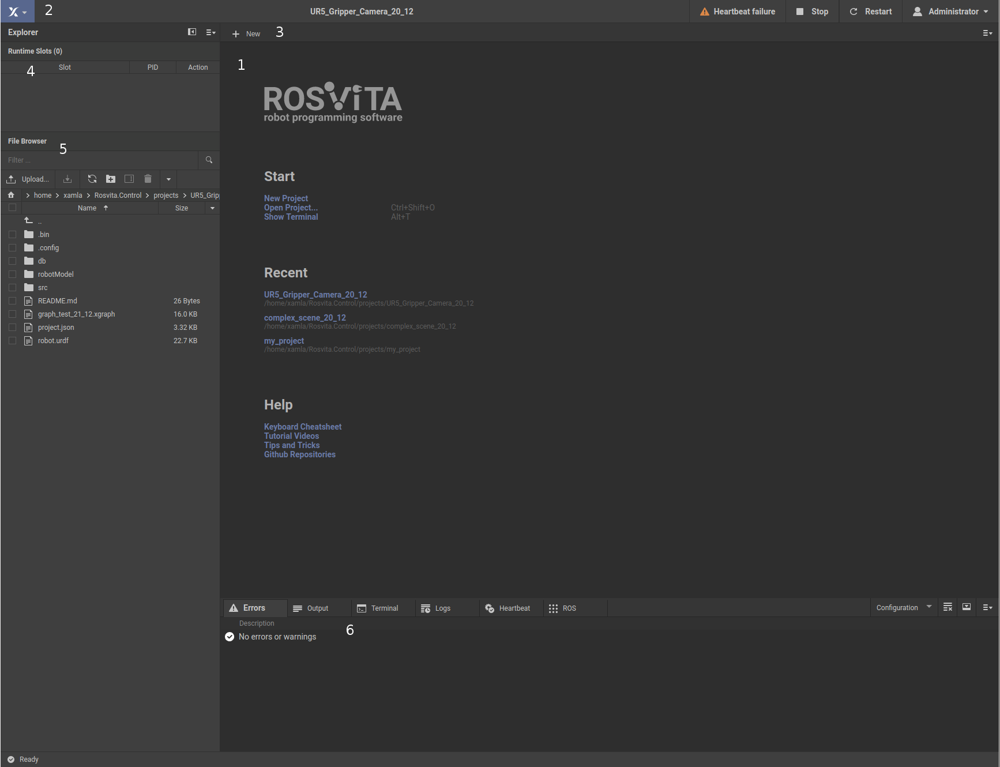
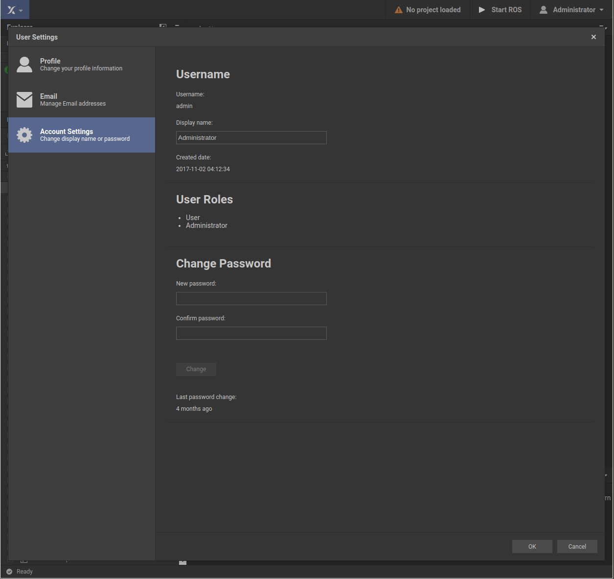

.. _main-view-label:

*********************
ROSVITA Main View
*********************

After successful download and start of the ROSVITA Docker image (see :ref:`previous chapter <getting-started-label>`), the login screen of ROSVITA appears (see Fig. 1.1).

   Figure 1.1  The ROSVITA Login Screen.

Type in your username and password (default: **admin** and **r2d2c3po**) and the ROSVITA main development environment opens (see :ref:`Fig. 1.2 <fig-main-view>`). You should **change your password** in your **Account Settings** (see later in this chapter and :ref:`Fig. 1.3 <fig-user-settings>`).

.. _fig-main-view:

   Figure 1.2  The ROSVITA Main View.

The main view of the ROSVITA robot programming environment (Fig. 1.2) consists of several parts:

1. A central start window (**multi document area**) from which a new project can be created and a stored project can be opened. Later, this window will display either the configuration of the robot (**Configuration View**), the **Robot Jogging**, the path planning (**World View**), the system monitoring (**Monitoring View**), an executable graph (**XGraph**), or an open file (e.g. a .xacro file).
2. A header that displays the current **project name** (if a project is opened), the **status** of the underlying ROS robot operating system and the logged in user.
3. Another header for each view. Depending on the selected view, there are buttons for compiling, saving, starting, stopping, selecting a kinematic chain (move group) for path planning, etc.
4. A listing of the loaded graphs (**XGraphs**) together with the corresponding process IDs (PIDs).
5. A **file browser** with file search, path display, upload/download between local computer and ROSVITA server, etc.
6. And finally, at the bottom, several switchable panes with:

   * a display of possible **error messages**
   * a display of all **outputs**
   * a **terminal** (e.g. to execute scripts)
   * a display of the **log outputs**
   * a display of the **heartbeat system monitoring**
   * a **ROS display** of ROS services and topics

All parts of the main view, apart from the central multi document area, can be collapsed.

.. note:: We recommend to **change your ROSVITA password** when logged in to ROSVITA for the first time. Thereto, simply go into your user settings, i.e. click on the user button at the top right of the ROSVITA environment and choose the menu item **Account Settings**. A screen called **User Settings** appears (see Fig. 1.3). There again choose "Account Settings", type in your new password and click onto the "Change" button.

.. _fig-user-settings:

   Figure 1.3  The ROSVITA User Settings Screen.

.. |Chrome_link| raw:: html

   <a href="https://www.google.com/intl/en-CA/chrome/" target="_blank">Chrome</a> 
