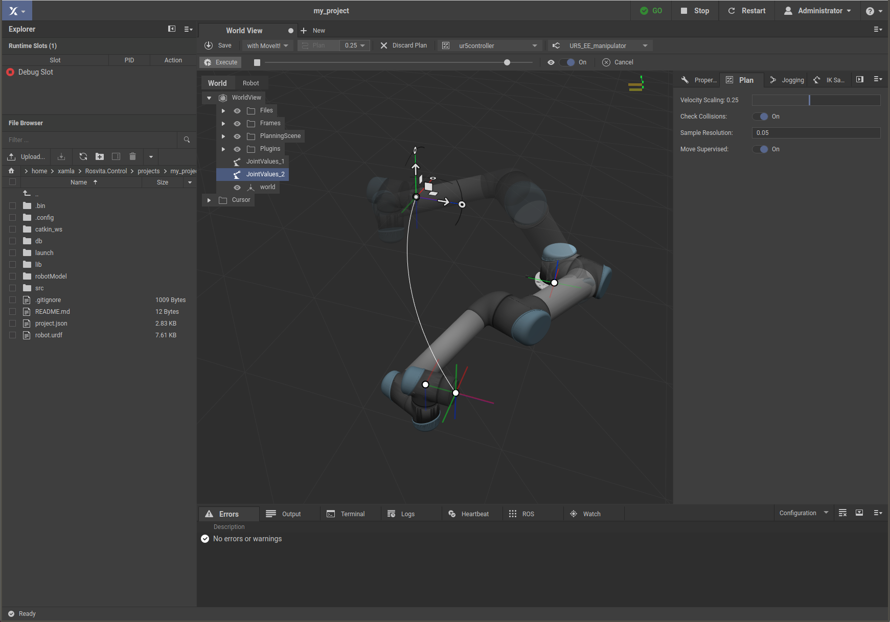
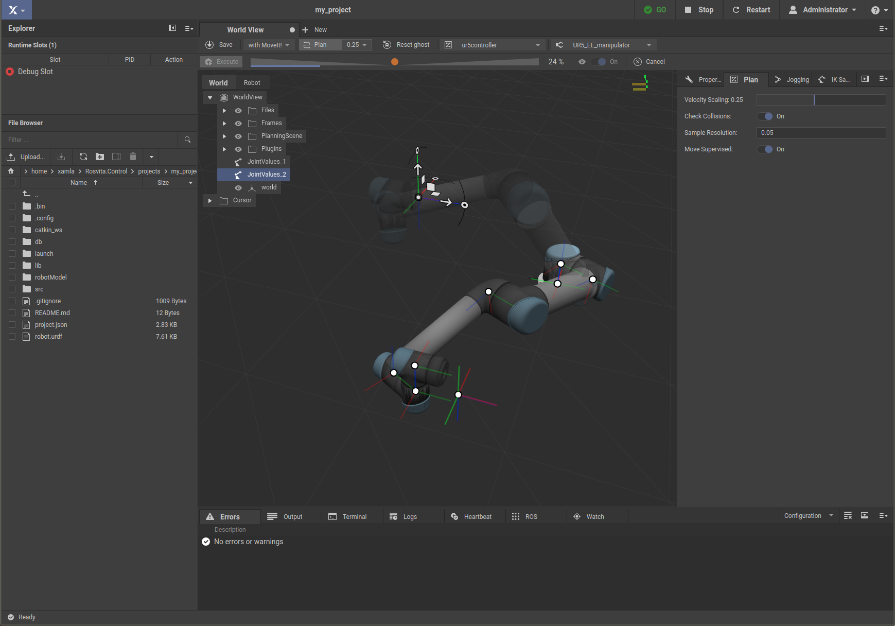

******************************
Path Planning ("World View") 
******************************

Once the robot configuration is complete and all ROS nodes have been successfully launched (indicated by a green **GO** with a check mark at the top bar), path planning can begin. To do this, switch to the planning view by clicking on the blue-highlighted **Xamla** symbol and selecting the menu item **World View**. A 3D view opens showing the configured robot  along with an **interactive marker** (movable coordinate system) at the **tool center point** (TCP) of the robot. Use the left mouse button to move and rotate the interactive marker. As a result, a semitransparent **ghost** of the robot will appear and follow the movements of the interactive marker. When the desired target pose is reached with the ghost, click on the **Plan** button at the top bar and a white path from the start pose to the target pose will appear (see Fig. 4.1). Moreover, the ghost will show the planned movement along the white path and an **Execute** and **Cancel** button appear below the top bar.

   Figure 4.1  World view with path planning for robot arm UR5.

.. note:: Path planning can only be performed if the current robot configuration has been compiled and all ROS nodes have been successfully started (displayed by a green **GO** with check mark in the top bar)!

On the **Plan** pane at the right sidebar of the world view you can adjust some plan parameters, which are the velocity scaling for the movement, the sample resolution for the path planning, the flag for collision checking, and the choice of supervised or unsupervised movement. 
By default, the **supervised movement** is chosen. Thus, after clicking on the **Execute** button at the top bar, a slide control appears next to this button (see Fig. 4.2). If, you move the slider to the right, the robot moves along the previously displayed path in direction of the target pose and if you move the slider to the left, the robot moves in direction of the starting pose. If the target pose is reached, ghost and actual robot merge, and the slider and the **Execute** button disappear. If you disable the **Move Supervised** flag and press **Execute** after path planning, the robot moves directly to the target pose without any further user interaction.

   Figure 4.2  Supervised movement of UR5.

The ghost serves as preview of ​​the target configuration of the robot. This allows to identify and avoid collisions in advance. Instead of directly moving the ghost, you can also move an **additional interactive marker** to a target pose. Thereto, double click into the scene and a second interactive marker will appear. Move this marker to the desired pose, click with the right mouse button into the scene and select the item **Move Ghost To Pose Picker**.

Next to the **Plan** button at the top bar, the path planner can be selected from a list (currently **MoveIt!**, **TVP** or **linear move**). **TVP** stands for **Trapezoidal Velocity Profile**, which is particularly suitable for time-critical problems without obstacles in the working area of ​​the robot. **MoveIt!** is a complex motion planning framework with collision check (i.e. self-collision as well as collision with obstacles in the scene) and based on the open motion planning library 
`OMPL <http://ompl.kavrakilab.org/>`_ .
Furthermore you can select the **Move group** and the **End effector** at the top bar, which especially becomes interesting with several robot arms.

By right-clicking in the scene, the current joint values and pose of the robot, as well as a current joint trajectory and Cartesian path can be saved. Moreover, as mentioned before, the ghost can be moved to the second interactive marker (called **pose picker**), **collision objects** can be added to the scene and the active cursor (i.e. the currently chosen interactive marker) can be rotated.
Saved joint values, poses, joint trajectories and collision objects appear in a list displayed on the left side of the **World View**. If you click on one of these saved elements, more detailed information about the selected element (e.g. names and values ​​for the joints) appears on the right of the **World View**. When selecting stored joint values, moreover the ghost automatically moves to the corresponding location.

.. note:: To save the stored joint values and poses **permanently**, the **World View** has to be saved by pressing the **Save** button at the top bar. Thereby, the joint values and poses are written to the project folder into **db/worldview.json**.

IK Sampling
-----------

At the right sidebar of the World View, you can find a **Properties** pane, a **Planning** pane, a **Jogging** pane and finally a pane for **Inverse Kinematik (IK) Sampling**. To perform IK sampling, move the tool center point (TCP) of the robot ghost (i.e. the interactive marker) to a desired target position and press the button **Start Sampling** of the IK sampling pane. Now, Rosvita will generate all possible joint configurations of the robot with the TCP located at the target position. In the IK Sampling pane at the right, all these joint configurations are shown. Click at one of these joint configurations and the joints of the robot ghost will move into this configuration. After pressing **Plan** and **Execute** (see above), also the joints of the real robot will adopt the chosen joint configuration.
