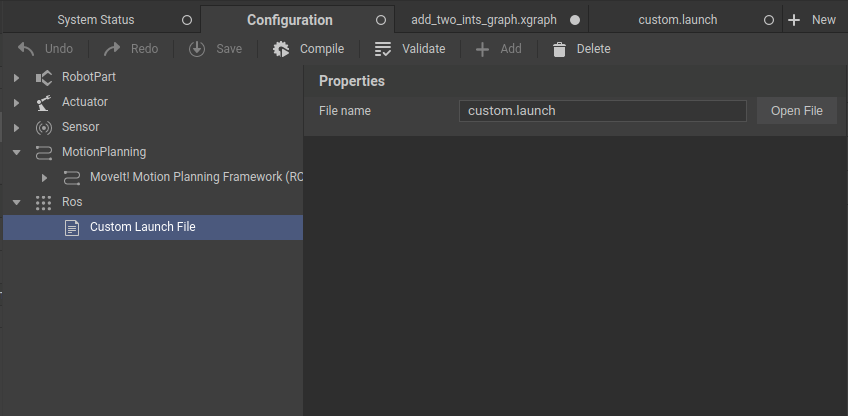
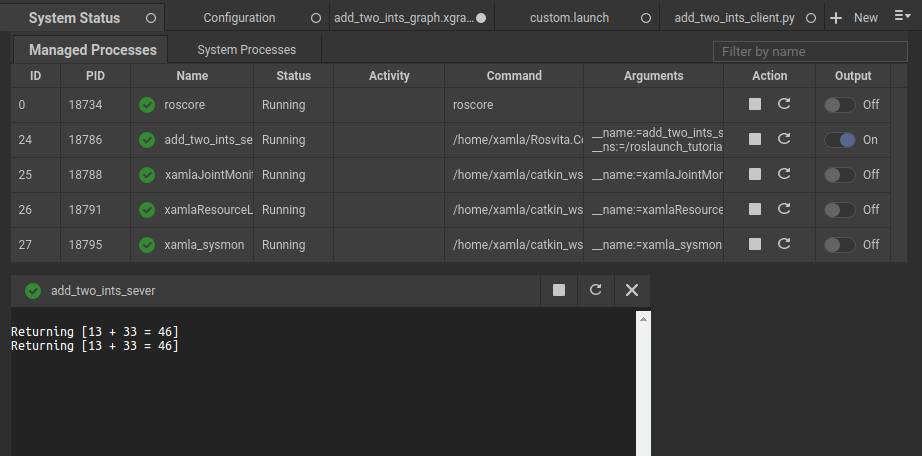
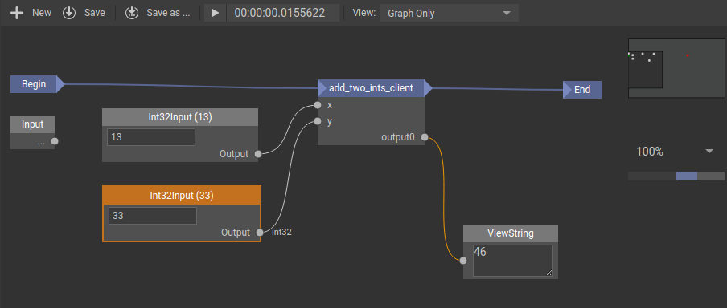

********************
ROSVITA and roslauch
********************

.. hint:: If you not already read the `Python in ROSVITA Graphs <Python_in_Rosvita_Graphs>`_ chapter, please read it first, it provides many insides which are prerequisite to understand the example we build up here to explain roslaunch. 

`roslaunch <https://wiki.ros.org/roslaunch>`_ is a set of tools which are shipped with ROS to easly launching multiple `ROS nodes <https://wiki.ros.org/rosnode>`_.
In ROSVITA the roslaunch tools are heavly in use and ROSVITA even extend the capabilities of the roslaunch which comes with ROS. Therefore, in many cases we have
not to interact with roslaunch directly and can use :doc:`ROSVITA`s Configuration View <Robot_Configuration>` to build up our robot configuration and environment for a
specific project. 

ROSVITA Custom Launch File
--------------------------

.. _custom-launch-file-figure-label:

   Figure 1  Configuration View custom launch file

But if you want to use some ROS packages which are provided by the large ROS ecosystem or you wrote your own ROS packages to meet your needs it is necessary to 
write a roslaunch file to launch the needed nodes from these packages. But again the most of the word is already abstracted by ROSVITA. In every ROSVITA project
a roslaunch file is already provided. It can be accessed over the Configuration View -> ROS -> Custom Launch File and then click on open (see :ref:`Figure 1 <custom-launch-file-figure-label>`).
If you correctly define your custom launch file ROSVITA will automatically launch all defined ROS nodes if you start ROS in ROSVITA.

.. code-block:: xml

    <?xml version="1.0" encoding="utf-8" standalone="yes"?>
    <launch>
    <!--
    Created by Rosvita

    Here you can add your custom launch file content.

    Minimal example:
    <node name="talker" pkg="rospy_tutorials" type="talker" />

    Extended example:
    <group ns="wg2">
        <node pkg="rospy_tutorials" type="talker" name="talker" args="- -test" respawn="true" >
        <remap from="chatter" to="hello" />
        <param name="talker_1_param" value="a value" />
        </node>
    </group>
    -->

When open a custom launch file of a fresh ROSVITA project you will see a file with the content shown above. It contains already a realy brief tutorial 
how to write a launch file. A full documentation about ROS launch files can be found here: `<https://wiki.ros.org/roslaunch/XML>`_. 

Tutorial: Custom Launch File, ROS node and ROSVITA Graph
--------------------------------------------------------
.. _project-hint-label:
.. hint:: The in the following shown resources are available in a ROSVITA project which can be downloaded here: `Link </examples/ROSVITA_and_roslaunch_tutorial.tar>`_. After that, untar it in your ROSVITA projects folder and open the project in ROSVITA.

In this tutorial we want to build a system which constists of following components:

* a ROS node which is launched via the custom launch file and provides a ROS service
* a python client implementation to call this service which complies all prerequisites to use it in a ROSVITA Graph context
* a ROSVITA Graph which uses the client implementation to interact with the ROS node

For the ROS node we will not write our own one but rather use a minimalistic example which is provided by the ROS tutorials. 
The ROS tutorial packages we use in this tutorial can be found here: `<https://github.com/ros/ros_tutorials>`_. In the provided `tutorial project </examples/ROSVITA_and_roslaunch_tutorial.tar>`_
we already clone these repository to the project catkin workspace. Therefore, the first thing we have to do building the catkin workspace. To do so please run following commands from in 
a the ROSVITA terminal starting at the tutorial project root:

.. code-block:: bash

    cd catkin
    catkin build
    source devel/setup.bash

The ROS node we want to use in this tutorial is the add_two_ints_server. Two check if the build and source process was successful we can 
use some ros command line magic. First we want to check is the ROS package we want to use is available. This is possible with the **rospack**
command. In our case we want to know if the package rospy_tutorials is available. The command **rospack find rospy_tutorials** does the trick.
If it returns a path the package is available else a error is returned. The node from these package we want to launch is the **add_two_ints_server**.
Therefore, the next step is to edit the custom launch file:

.. code-block:: xml

    <?xml version="1.0" encoding="utf-8" standalone="yes"?>
    <launch>
    <!--
    Created by Rosvita

    Here you can add your custom launch file content.

    Minimal example:
    <node name="talker" pkg="rospy_tutorials" type="talker" />

    Extended example:
    <group ns="wg2">
        <node pkg="rospy_tutorials" type="talker" name="talker" args="- -test" respawn="true" >
        <remap from="chatter" to="hello" />
        <param name="talker_1_param" value="a value" />
        </node>
    </group>

    For more information see: http://wiki.ros.org/roslaunch/XML
    -->
    <!-- add a group namespace -->
    <group ns="roslaunch_tutorial">
        <!-- from package rospy_tutorials launch the node add_two_ints_server as add_two_ints_server -->
        <node pkg="rospy_tutorials" type="add_two_ints_server" name="add_two_ints_server" respawn="true"/> 
    </group>
    </launch>

After editing and save the custom launch file as shown we can start ROS in ROSVITA.
To check if the nodes which should be launched by the custom launch file are up and running you can 
use the ROSVITA System Status View which can be accessed by double clicking on the ROS status symbol. 
You should see the something simular to this:

.. _rosvita-monitor-view-figure-label:

   Figure 2  ROSVITA System Status View: running add_two_ints_server

If the node not show up in the System Status View or the symbol in front of the node name indicate an error you have
to further investigate the problem. Add good start is oftentimes the node output. To see the node output just double
click on the node name in the name column or click on the output switch in the last column.  
Next we can start implementing our python client (already provided in tutorial project **add_two_ints_client.py**):

.. code-block:: python

    #!/usr/bin/env python3

    import re
    import rospy

    # imports the AddTwoInts service 
    from rospy_tutorials.srv import AddTwoInts, AddTwoIntsRequest

    # full service name: group namespace, node service name 
    service_name = 'roslaunch_tutorial/add_two_ints'

    # define function with type hint, thus it is possible to use it in ROSVITA Graphs
    def add_two_ints_client(x: int, y: int)->int:

        if (re.sub('[^A-Za-z0-9]+', '', rospy.get_name()) == 'unnamed'):
            rospy.init_node('rospy_node', anonymous=True)

        # block until the add_two_ints service is available
        # or time out is exceeded
        rospy.wait_for_service(service_name, timeout=3.0)
        
        # create a handle to the add_two_ints service
        add_two_ints = rospy.ServiceProxy(service_name, AddTwoInts)
        
        # call the ros service and wait until response
        resp = add_two_ints.call(AddTwoIntsRequest(x, y))
        
        return resp.sum

Then just drag and drop the python file into a new ROSVITA Graph (graph already provided in the tutorial project **add_two_ints_graph.xgraph** just open it).
After running the graph you should see something simular to this:

.. _add-two-ints-graph-figure-label:

   Figure 3  ROSVITA Graph: add_two_ints_graph

You can play a little bit with the inputs. What is now actually happen when you run the graph is that the graph execute the python client implementation
in the ROSVITA Graph python runtime, this is then calling the ROS services which is provided by the ROS node add_two_inits_server. After finishing the
computation the service result is return back via ROS to the ROSVITA Graph python runtime. In a last step the result and before that also the input
is transformed from a python type to a ROSVITA Graph type and vise versa.