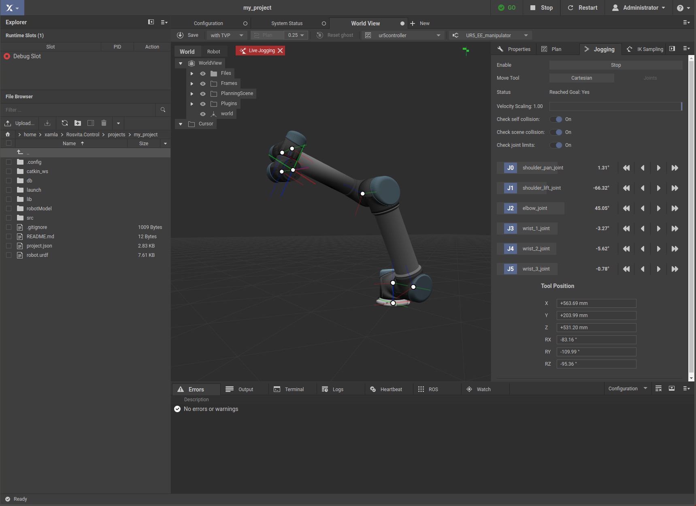

****************
Robot Jogging
****************

In addition to automatic path planning, ROSVITA also offers the possibility of manual, **step-by-step control** of the robot movement (comparable to the robot control via **teach pendant**). In the **World View** click on the **Jogging** pane at the right sidebar. At the bottom of this sidebar pane, you find a display of the current **Tool Position**, which is updated in real-time as the robot moves. 

   Figure 5.1  Start robot jogging.

Above this **Tool Position** display you can set the **Velocity Scaling** and the **Reference Frame** for the driving commands. Moreover, at the top bar of the world view, you can choose the **move group** of the robot and the corresponding **end effector** (e.g. for an SDA10, which has two arms, you can choose between several move groups).

Press the **Start** button in the jogging pane of the right sidebar, to enable the robot jogging (see Fig. 5.1).

12 driving command buttons appear in the sidebar, namely translation in +/- x, y, and z direction, as well as rotation around +/- x, y, and z axis of the reference coordinate system (see Fig. 5.2). The robot moves as soon as you click on one of these driving command buttons. When the **Cartesian** robot jogging is selected as **Move Tool** at the top of the sidebar, the interactive marker for moving the robot is also available.

.. figure:: ../images/Robot_jogging_cartesian.png

   Figure 5.2  Cartesian robot jogging.

Alternatively, instead of choosing the Cartesian robot control, one can also select the control of the individual joint angles (**Joints**) as **Move Tool**. The sidebar will then show the joints of the selected **Move Group** along with the current joint angle for each joint and with left/right arrows next to each joint (see Fig. 5.3). Pressing one of these arrows will rotate the corresponding robot axis gradually around the choosen joint.

   Figure 5.3  Robot jogging via joints.

